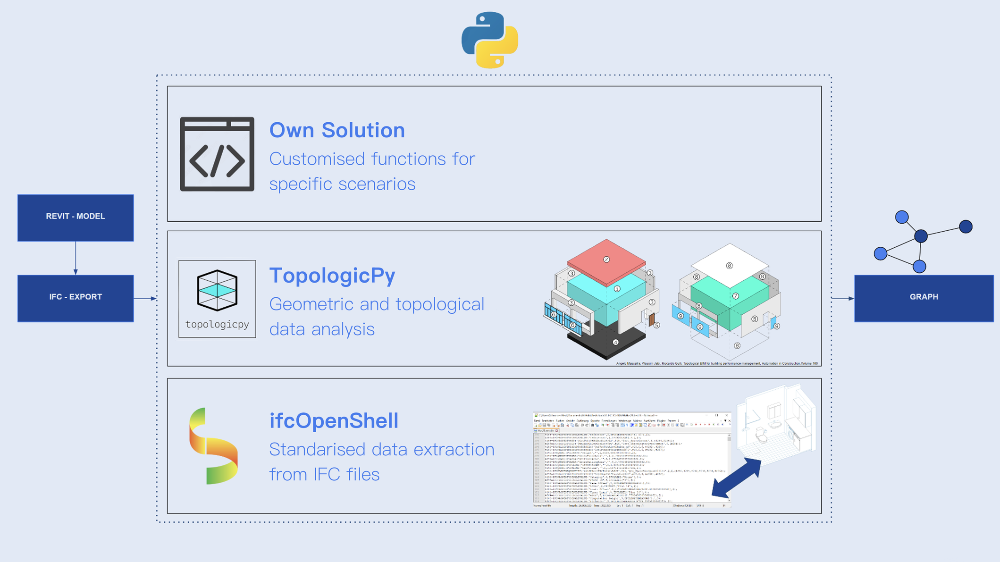

# BIMConverse — Thesis Work

**Turning BIM archives into knowledge graphs you can talk to.**



This repository holds the research work behind **BIMConverse**: the pipeline that converts
IFC files into a Neo4j labelled property graph, the resulting graph data, and the
experiments around querying it with an LLM.

It was developed by **Libny Pacheco** and **Christoph Berkmiller** as the 2024 thesis for
IAAC's **MaCAD** programme (Master in Advanced Computation for Architecture & Design), and
is documented in the book chapter *BIMConverse: Unlocking BIM Data for Everyone*
(Chapter 16).

> **Looking for the chat app?** It lives in its own repository:
> **[libnypacheco/bimconverse](https://github.com/libnypacheco/bimconverse)** — a Next.js
> single-page app, adapted from Neo4j Labs' NeoConverse, that translates natural-language
> questions into Cypher and back.

---

## The idea

BIM authoring tools store a great deal of data but query it poorly. Following Ackoff's
knowledge pyramid, an IFC file gives you **data** (a wall's thickness, a room's area). Put it
in a graph and you get **information** (this door has a 60-minute rating and opens onto a
corridor). Traverse that graph and you get **knowledge** (the typical build-up of a wall
between a bedroom and a kitchen, across a whole archive).

The catch is that graphs need a query language. So the full workflow runs in two directions:

```
BIM file → Graph → Graph Database ← Cypher Query ← LLM ← User question
```

**This repository is the left-hand side** — getting a building into the graph.
[bimconverse](https://github.com/libnypacheco/bimconverse) is the right-hand side.

---

## Repository map

| Folder | What's in it |
|---|---|
| [`01_GH_SCRIPTS`](./01_GH_SCRIPTS) | Early Grasshopper / Rhino.Inside.Revit prototypes and TopologicPy experiments |
| [`10_IFC_TO_GRAPH`](./10_IFC_TO_GRAPH) | **The pipeline.** Numbered Python scripts converting IFC into a Neo4j graph, plus sample IFC files |
| [`20_GRAPH-DATA`](./20_GRAPH-DATA) | Generated graph data per project and storey, and a full `neo4j.dump` |
| [`30_GRAPH-RAG`](./30_GRAPH-RAG) | Text-to-Cypher experiments |
| [`40_BIMCONVERSE_APP`](./40_BIMCONVERSE_APP) | App assets — the app itself is in [libnypacheco/bimconverse](https://github.com/libnypacheco/bimconverse) |
| [`90_DOCU_TOPOPY`](./90_DOCU_TOPOPY) | TopologicPy API reference dumps, kept for offline lookup |

---

## The pipeline

Revit models are exported to IFC with **second-level space boundaries**
(`IfcRelSpaceBoundary`) and **all property sets** enabled — both are essential, and the
quality of everything downstream depends on this export configuration.

From there the work splits across three kinds of tooling, as shown in the diagram above:

- **[IfcOpenShell](https://ifcopenshell.org/)** — standardised extraction of *explicit* data:
  elements, attributes and the relationships IFC already states, such as `ContainedIn`
  (`IfcRelContainedInSpatialStructure`) and `HostedBy` (`IfcRelFillsElement`).
- **[TopologicPy](https://topologicpy.readthedocs.io/)** — geometric and topological analysis
  to derive what IFC does *not* state: which walls physically touch, and which rooms are
  directly connected across a logical line rather than through a door.
- **Custom functions** — for the cases neither library covers, above all mapping a wall's
  ordered material list onto its reconstructed geometric layers.

### Running order

The scripts in [`10_IFC_TO_GRAPH`](./10_IFC_TO_GRAPH) are numbered in execution order. Steps
001–003 write intermediate CSVs; 004 builds the graph; 005A enriches it.

| Script | Does | Produces |
|---|---|---|
| `001_MakeCSV_AdjacentRooms.py` | Derives room-to-room adjacency with TopologicPy — via separation lines, doors and windows | `Output01`–`Output03` |
| `002_MakeCSV_ReadFromIFC.py` | Reads explicit IFC data: doors, windows, room-bounding walls, hosts | `Output04`, `Output05` |
| `003_MakeCSV_AdjacentWalls.py` | Wall-to-wall adjacency — `find_touching_walls` merges two wall cells and tests for shared faces | `Output06` |
| `004_BuildGraph.py` | Creates nodes and relationships in Neo4j from the IFC and the CSVs | the graph |
| `005A_EnrichtGraph_Alternative.py` | Adds wall layers, materials and derived topological relationships | an enriched graph |

Supporting modules: `ifc_data_to_csv.py`, `find_adjacent_rooms.py`, `find_adjacent_walls.py`,
`ifc_wall_analyzer.py` and `neo4j_functions.py` (all node and relationship creation).

Processing runs **storey by storey** — set the target in `config.yaml`.

---

## The graph model

| Node label | Selected attributes |
|---|---|
| `Room` | GlobalId, Name, Project, Level, Height, GrossFloorArea, GrossNetArea, GrossVolume |
| `Wall` | GlobalId, Name, Project, Level, IsExternal, LoadBearing, Height, Length, Width, Type Mark |
| `Door` | GlobalId, Name, Project, Level, IsExternal, Rough Height/Width, Material Panel, Material Frame, OperationType, Construction Type, Function |
| `Window` | GlobalId, Name, Project, Level, IsExternal, Rough Height/Width, SillHeight, Material Exterior/Interior, Panel Operation, Type Mark |
| `Furniture` | OID, Name, Project, Level |
| `Material` | OID, Material Name, Project, Function |

| Relationship | Meaning | Source |
|---|---|---|
| `ContainedIn` | Wall / Door / Window / Furniture → Room | explicit (IFC) |
| `HostedBy` | Door / Window → Wall | explicit (IFC) |
| `Access` | Room → Room, with `AccessType`: Direct, Door, Window, Stair | explicit + derived |
| `IsConnected` | Wall → Wall physical adjacency | derived (TopologicPy) |
| `ConsistsOf` | Wall → its material layers | custom |
| `IsFacing` | Layer → Room it faces | custom |
| `InternallyConnected` | Layer → Layer within a wall | custom |

Uniqueness constraints on `GlobalId`, relationship validation and cleanup of isolated nodes
keep the graph consistent across imports.

### The wall layer problem

The one place where off-the-shelf tooling was not enough. At the time of the research,
TopologicPy's list of a wall's *geometric* layers did not reliably line up with the wall's
*material* list, which made automated mapping impossible and risked silently wrong results.

The fix is a layer-by-layer reconstruction: extract the ordered material list from IFC;
in parallel rebuild each layer's 3D solid from its 2D profile, applying the rotation matrix
to bring it from local into absolute project coordinates; then map the two ordered lists onto
each other. That is what makes questions like *"which wall layers face this room, and are
they water-repellent?"* answerable at all.

---

## Graph data

[`20_GRAPH-DATA`](./20_GRAPH-DATA) contains generated graphs for projects `0301`, `2601`,
`2602`, `3501` and `HUS28`, organised by storey, plus **`neo4j.dump`** — a full database
dump.

To explore the results without running the pipeline, restore the dump into a local Neo4j
instance and point the [BIMConverse app](https://github.com/libnypacheco/bimconverse) at it:

```bash
neo4j-admin database load neo4j --from-path=./20_GRAPH-DATA --overwrite-destination=true
```

---

## Getting started

**Prerequisites** — Python 3, [Neo4j Desktop](https://neo4j.com/download/), and:

```bash
pip install ifcopenshell topologicpy neo4j pyyaml numpy
```

**Configure** `10_IFC_TO_GRAPH/config.yaml` with your IFC file, target storey and database
connection:

```yaml
ifc_file: "2601.ifc"
storey_name: "PLAN 11, TRH 1"
uri: "bolt://localhost:7687"
username: "neo4j"
password: "<your password>"
```

**Run** the scripts in numbered order from inside `10_IFC_TO_GRAPH`:

```bash
python 001_MakeCSV_AdjacentRooms.py
python 002_MakeCSV_ReadFromIFC.py
python 003_MakeCSV_AdjacentWalls.py
python 004_BuildGraph.py
python 005A_EnrichtGraph_Alternative.py
```

`0301.ifc` and `Hus28_test.ifc` are included as samples. Then connect the
[BIMConverse app](https://github.com/libnypacheco/bimconverse) to the database and start
asking questions.

---

## Case study

The method was developed against an archive of **60 BIM projects from White Arkitekter**
(2016–2022) — residential work from small multi-family houses to large complexes, all past
the Swedish planning application stage (*bygglöv*).

Conversion time scales with project size: a five-family building processed in under two
minutes; an 80-apartment complex took up to 50 minutes per floor, several hours in total.
The dominant difficulty was not geometry but **heterogeneity** — inconsistent parameter names
and values across a multi-year archive, especially in window and door families. Handling that
required iterative mapping work, and it points at an industry-wide problem: fully automated
systems will need far more sophisticated schema mapping than an ad-hoc list of known
variations.

Known limits of the current model: it is **floor-by-floor**, so vertical connectivity for
multi-storey elements is missing; adjacency is an N-to-N computation that needs spatial
pre-filtering (octrees) to scale; and pathfinding is purely topological, so routes can pass
through private apartments because the graph does not yet encode public/private semantics.

---

## Credits

Thesis by **Libny Pacheco** and **Christoph Berkmiller**, IAAC MaCAD 2024.

Thanks to German Otto Bodenbender, David Leon, Laura Ruggeri, Bao Trinh, João Silva, and
Professor Wasim Jabi for his time and expertise on TopologicPy. Thanks to White Arkitekter —
Peter Lechouvious, Adalaura Diaz, Martin Johnson, John Nordman and Zebastian Olsson — for
helping us locate and access the Revit archive.

### Key references

- Ackoff, R.L. (1989). From data to wisdom. *Journal of Applied Systems Analysis*, 16, 3–9.
- Zhu, J., Wu, P., & Lei, X. (2023). IFC-graph for facilitating building information access
  and query. *Automation in Construction*, 148, 104778.
- Massafra, A., Jabi, W., & Gulli, R. (2024). Topological BIM for building performance
  management. *Automation in Construction*, 166, 105628.
- Khalili, A., & Chua, D.K.H. (2015). IFC-based graph data model for topological queries on
  building elements. *Journal of Computing in Civil Engineering*, 29, 04014046.
- Abudaldenien, J., & Borrmann, A. (2021). PBG: A parametric building graph capturing and
  transferring detailing patterns of building models. *CIB W78 2021*.

---

## License

[MIT](./LICENSE).
